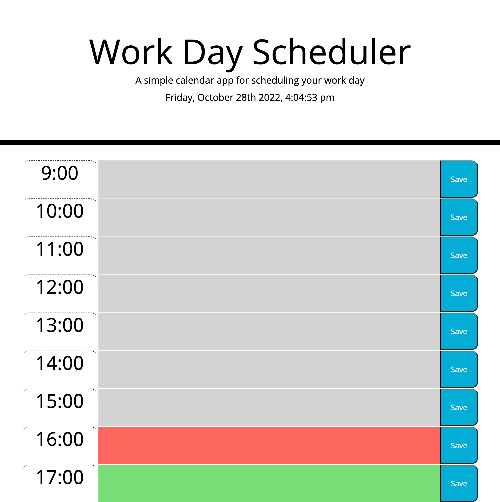

# Work-Day-Scheduler

## Description

Simple calendar application that allows users to save events for each hour of the work day. When the user clicks the save button the event will be stored and loaded when the page is opened again or refreshed. The text background is color coded to allow the user to see if events are in the past(grey), present(red), or future(green).

## Screenshot

## Link to application

